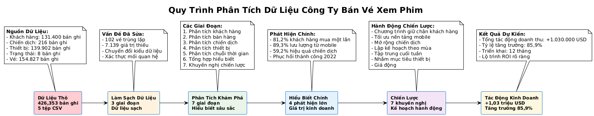

# Movie Ticket Company — Customer & Campaign Data Analysis

## Giới thiệu dự án

Dự án này thực hiện **phân tích dữ liệu toàn diện** hoạt động của **công ty bán vé xem phim trực tuyến**, bao gồm:

* **Data Cleaning**: Làm sạch và chuẩn hóa dữ liệu từ 426,353 records
* **Exploratory Data Analysis**: Phân tích 7 phases chi tiết về khách hàng, bán hàng, chiến dịch, thiết bị và xu hướng thời gian
* **Business Insights**: Đưa ra 7 chiến lược actionable với tiềm năng tăng trưởng **+$1.03M (86.0%)**
* **Strategic Recommendations**: Roadmap triển khai 3 giai đoạn trong 12 tháng

---

## Mục tiêu chính

1. **Customer Analysis**: Phân tích demographics, behavior và segmentation (81.2% single-purchase customers)
2. **Sales Analysis**: Đánh giá revenue trends, pricing strategy và success rate (100%)
3. **Campaign Analysis**: Đo lường ROI và effectiveness (59.2% campaign effectiveness)
4. **Device & Platform**: Phân tích mobile vs web performance (89.3% mobile dominance)
5. **Time Series**: Khám phá seasonal patterns và COVID recovery (+699.8% growth in 2022)
6. **Strategic Planning**: Đưa ra actionable recommendations cho business growth

---

## Dữ liệu và cấu trúc

| File                   | Vai trò  | Records | Mô tả ngắn gọn                                                                                 |
| ---------------------- | --------- | ------- | -------------------------------------------------------------------------------------------------- |
| `customer.csv`       | Dimension | 131,400 | Thông tin khách hàng: ID, giới tính, ngày sinh                                               |
| `campaign.csv`       | Dimension | 217     | Thông tin chiến dịch marketing: ID, loại chiến dịch (direct discount, voucher, reward point) |
| `device_detail.csv`  | Dimension | 139,901 | Thiết bị truy cập: device_number, model, platform (mobile/website)                              |
| `status_detail.csv`  | Dimension | 8       | Trạng thái ticket: status_id, description, error_group                                           |
| `ticket_history.csv` | Fact      | 154,647 | Lịch sử đặt vé: ticket_id, customer_id, campaign_id, device_number, prices, time              |

### **Clean Data Output:**

- **No Missing Values**: Tất cả missing values đã được xử lý
- **No Duplicates**: 102 duplicate tickets đã được loại bỏ
- **Data Consistency**: Foreign key relationships đã được chuẩn hóa
- **Business Logic**: Giá vé validation (final_price = original_price - discount_value)

---

## Mô hình dữ liệu (Star Schema)

```
                   +--------------------+
                   |   dim_campaign     |
                   |   (217 records)    |
                   +--------------------+
                            ▲
                            │
+--------------+     +---------------+     +-----------------+
| dim_customer | ◄──► fact_ticket    ◄──► | dim_device       |
|(131,400 rec) |     |(154,647 rec)   |     |(139,901 rec)    |
+--------------+     +---------------+     +-----------------+
                            │
                            ▼
                   +--------------------+
                   |   dim_status       |
                   |   (8 records)      |
                   +--------------------+
```

### Fact Table

**`ticket_history`** - 154,647 records

* Mỗi dòng đại diện cho một giao dịch đặt vé
* Các cột chính:
  * `ticket_id`, `customer_id`, `campaign_id`, `device_number`, `status_id`
  * `original_price`, `discount_value`, `final_price`, `time`, `movie_name`
  * `paying_method`, `theater_name`

### Dimension Tables

| Bảng             | Records | Mục đích             | Cột chính                         |
| ----------------- | ------- | ----------------------- | ----------------------------------- |
| `customer`      | 131,400 | Thông tin khách hàng | customer_id, usergender, dob        |
| `campaign`      | 217     | Chiến dịch marketing  | campaign_id, campaign_type          |
| `device_detail` | 139,901 | Thiết bị truy cập    | device_number, model, platform      |
| `status_detail` | 8       | Trạng thái ticket     | status_id, description, error_group |

---

## Quy trình xử lý dữ liệu (ETL Pipeline)

### **Phase 1: Data Discovery & Assessment**

- ✅ Phân tích cấu trúc dữ liệu (426,353 records)
- ✅ Kiểm tra missing values (3 vấn đề phát hiện)
- ✅ Kiểm tra duplicates (102 duplicate tickets)
- ✅ Kiểm tra data types và business logic

### **Phase 2: Data Type Conversion & Business Logic**

- ✅ Chuyển đổi datetime (dob, time)
- ✅ Validation business logic giá vé (100% đúng)
- ✅ Kiểm tra foreign key relationships
- ✅ Xử lý orphan records

### **Phase 3: Data Cleaning & Final Preparation**

- ✅ Xử lý 102 duplicate tickets
- ✅ Fill 7,139 missing device.model với "Unknown"
- ✅ Tạo "No Campaign" record cho campaign_id = 0
- ✅ Export clean datasets (5 files)

### **Phase 4-10: Exploratory Data Analysis**

- ✅ **Customer Analysis**: Demographics, behavior, segmentation
- ✅ **Sales Analysis**: Revenue trends, pricing, success rate
- ✅ **Campaign Analysis**: ROI, effectiveness, types
- ✅ **Device Analysis**: Mobile vs web, platform performance
- ✅ **Time Series**: Seasonal patterns, COVID impact, growth
- ✅ **Final Insights**: Strategic recommendations, business projections

---



## Các chỉ số (KPI) chính

### **Business Performance**

| Chỉ số                       | Giá trị     | Mô tả                           |
| ------------------------------ | ------------- | --------------------------------- |
| **Tổng Doanh Thu**      | $1,199,460.47 | Tổng revenue từ 154,647 tickets |
| **Tổng Số Vé**        | 154,647       | Tổng số tickets đã bán       |
| **Tổng Khách Hàng**   | 119,477       | Số lượng unique customers      |
| **Giá Vé Trung Bình** | $7.76         | Average ticket price              |
| **Tỷ Lệ Thành Công** | 100%          | Success rate của transactions    |

### **Customer KPIs**

| Chỉ số                         | Giá trị | Insight                      |
| -------------------------------- | --------- | ---------------------------- |
| **Doanh Thu/Khách Hàng** | $10.04    | Revenue per customer         |
| **Vé/Khách Hàng**       | 1.29      | Average tickets per customer |
| **Single Purchase**        | 81.2%     | Khách hàng mua một lần   |
| **VIP Customers**          | 18.8%     | Khách hàng mua 2+ tickets  |

### **Platform KPIs**

| Chỉ số                  | Giá trị  | Insight                |
| ------------------------- | ---------- | ---------------------- |
| **Mobile Usage**    | 89.3%      | Thị phần mobile      |
| **Website Usage**   | 10.7%      | Thị phần website     |
| **Mobile Revenue**  | $1,071,209 | 89.3% of total revenue |
| **Website Revenue** | $128,251   | 10.7% of total revenue |

### **Campaign KPIs**

| Chỉ số                         | Giá trị | Insight                        |
| -------------------------------- | --------- | ------------------------------ |
| **Campaign Effectiveness** | 59.2%     | Tỷ lệ tickets từ campaigns  |
| **No Campaign**            | 40.8%     | Tickets không có campaign    |
| **Direct Discount**        | 35.2%     | Campaign type phổ biến nhất |
| **Voucher**                | 15.1%     | Campaign type thứ 2           |

---

## Kết quả đạt được

### **Strategic Recommendations**

| Chiến lược                        | Tác động dự kiến | Mục tiêu                         |
| ------------------------------------ | --------------------- | ---------------------------------- |
| **Giữ Chân Khách Hàng**    | +$150K                | Chuyển đổi 20% single customers |
| **Tối Ưu Nền Tảng**        | +$160K                | Tăng mobile conversion 15%        |
| **Chiến Lược Chiến Dịch** | +$200K                | Duy trì 59.2% effectiveness       |
| **Chiến Lược Theo Mùa**    | +$180K                | Tăng trưởng 20% peak months     |
| **Chiến Lược Cuối Tuần**  | +$120K                | Tăng weekend revenue 25%          |
| **Chiến Lược Thiết Bị**   | +$100K                | Tăng iPhone engagement 20%        |
| **Chiến Lược Giá Cả**     | +$120K                | Tăng avg ticket price 10%         |

### **Total Business Impact**

- **Tổng tác động tiềm năng**: +$1,030,000
- **Tăng trưởng doanh thu**: 86.0%
- **Doanh thu dự kiến**: $2,229,460.47

### **Implementation Timeline**

- **Giai đoạn 1 (0-3 tháng)**: Customer retention + Platform optimization
- **Giai đoạn 2 (3-6 tháng)**: Campaign strategy + Weekend strategy
- **Giai đoạn 3 (6-12 tháng)**: Seasonal + Device + Pricing strategies

---

## Công nghệ & Công cụ

| Mục đích                       | Công cụ được sử dụng                 | Mục đích                            |
| --------------------------------- | ------------------------------------------- | -------------------------------------- |
| **Phân tích dữ liệu**   | Python (pandas, numpy, matplotlib, seaborn) | Data cleaning, EDA, visualization      |
| **Data Cleaning**           | Pandas, NumPy                               | Missing values, duplicates, data types |
| **Visualization**           | Matplotlib, Seaborn                         | Charts, graphs, business insights      |
| **Notebook**                | Jupyter Notebook                            | Interactive analysis và documentation |
| **Data Storage**            | CSV files                                   | Clean datasets export                  |
| **Quản lý môi trường** | `uv`                                      | Dependency management                  |
| **Documentation**           | Markdown                                    | Professional Vietnamese documentation  |

---

## Cấu trúc thư mục hoàn chỉnh

```
Movie-Ticket-Company-Customer-Campaign-Data-Analysis/
 ┣ data/
 ┃ ┣ campaign.csv                    # Raw data: 216 records
 ┃ ┣ customer.csv                    # Raw data: 131,400 records  
 ┃ ┣ device_detail.csv               # Raw data: 139,902 records
 ┃ ┣ status_detail.csv               # Raw data: 8 records
 ┃ ┣ ticket_history.csv              # Raw data: 154,827 records
 ┃ ┗ cleaned/                        # Clean datasets
 ┃   ┣ campaign_cleaned.csv          # Clean: 217 records
 ┃   ┣ customer_cleaned.csv          # Clean: 131,400 records
 ┃   ┣ device_detail_cleaned.csv     # Clean: 139,901 records
 ┃   ┣ status_detail_cleaned.csv     # Clean: 8 records
 ┃   ┗ ticket_history_cleaned.csv    # Clean: 154,647 records
 ┣ notebooks/
 ┃ ┣ 01_data_cleaning.ipynb          # Data cleaning: 3 phases
 ┃ ┗ 02_eda.ipynb                    # EDA: 7 phases analysis
 ┣ README.md                         # Project documentation
 ┣ pyproject.toml                    # Dependencies
 ┗ uv.lock                          # Lock file
```

### **Notebook Contents**

#### **01_data_cleaning.ipynb** (1,332 lines)

- **Phase 1**: Data Discovery & Assessment
- **Phase 2**: Data Type Conversion & Business Logic Validation
- **Phase 3**: Data Cleaning & Final Preparation
- **Export**: 5 clean CSV files

#### **02_eda.ipynb** (2,562 lines)

- **Phase 1**: Data Loading & Overview
- **Phase 2**: Customer Analysis (Demographics & Behavior)
- **Phase 3**: Sales Analysis (Revenue & Pricing)
- **Phase 4**: Campaign Analysis (ROI & Effectiveness)
- **Phase 5**: Device & Platform Analysis (Mobile vs Web)
- **Phase 6**: Time Series Analysis (Seasonal Patterns)
- **Phase 7**: Final Insights & Recommendations

---

> Đây là dự án học tập của cá nhân mình, nếu có sai sót hoặc muốn bổ sung và góp ý hãy kết nối với mình nhé !
